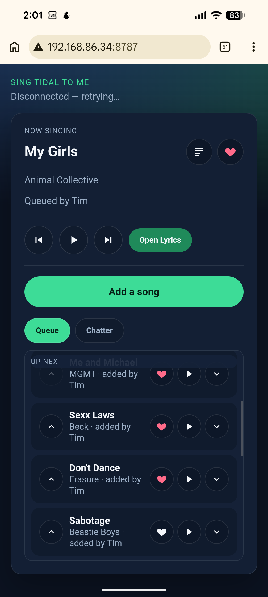

# Sing Sing Sing

Phone based sing-along companion for **Tidal on Google TV**.




The Android TV app shows a QR code. Guests on the same Wi‑Fi open the page, join with a name, search Tidal, and manage a shared singing queue. The TV app drives the official Tidal app through Android `MediaController` APIs.

## Prerequisites

- JDK 17+
- Android SDK (`local.properties` → `sdk.dir`)
- Google TV with wireless debugging enabled
- Tidal developer app credentials from [developer.tidal.com](https://developer.tidal.com)

## Configure

You'll need to visit [developer.tidal.com/dashboard](https://developer.tidal.com/dashboard/) and create an Application. Put your Client ID and Client Secret in local.properties.

```properties
# local.properties
sdk.dir=/home/you/Android/Sdk
TIDAL_CLIENT_ID=your_client_id
TIDAL_CLIENT_SECRET=your_client_secret
PARTY_PORT=8787
TIDAL_COUNTRY_CODE=US
```

## Build

```bash
export ANDROID_HOME="$HOME/Android/Sdk"
./gradlew :app:assembleDebug
./gradlew test
```

Debug APK:

`app/build/outputs/apk/debug/app-debug.apk`

## Sideload to Google TV

From the machine that already has `adb` connected to the TV (your Windows host works):

```powershell
adb install -r app-debug.apk
adb shell am start -n com.singsingsing.debug/com.singsingsing.ui.JoinActivity
```

## First-run setup on the TV

1. Open **Sing Sing Sing**.
2. Grant **notification access** (required to control Tidal's media session).
3. Optionally enable the **Open Tidal lyrics** accessibility service.
4. Start Tidal and play anything once so a media session exists.
5. Scan the QR code from phones on the same Wi‑Fi.

### Karaoke library (optional)

The Karaoke library is a playlist in Tidal that saves your most commonly sung songs. You can click the heart to add to this playlist once it's setup, and it shows up as the first browsable source when adding a song.

1. In [developer.tidal.com/dashboard](https://developer.tidal.com/bashboard) → your app → **Redirect URIs**, add the callback shown on the TV when you tap **Sign in to Tidal** (it looks like `http://<tv-lan-ip>:8787/oauth/callback`).
2. On the TV: **Settings → Sign in to Tidal** → open the login URL / QR on your phone (same Wi‑Fi) and approve. This will give you the Redirect URI with the correct URL if you don't have it.
3. After the phone shows “Signed in”, on the TV choose **Choose karaoke library playlist**.

## Guest features

- Join with a name
- Browse the karaoke library playlist / search all Tidal
- Add songs to the shared queue with attribution messages
- Play / pause / skip / previous / reorder / jump-to-track
- Heart a queued track into the karaoke library playlist
- Open lyrics on the TV; tap the lyrics icon next to now-playing for live synced lyrics on the phone (LRCLIB)

## Docs

- [docs/ARCHITECTURE.md](docs/ARCHITECTURE.md)
- [docs/BUSINESS_LOGIC.md](docs/BUSINESS_LOGIC.md)
- [docs/ROBOT_KARAOKE.md](docs/ROBOT_KARAOKE.md) — future: substitute-lyrics ("robot karaoke") design
